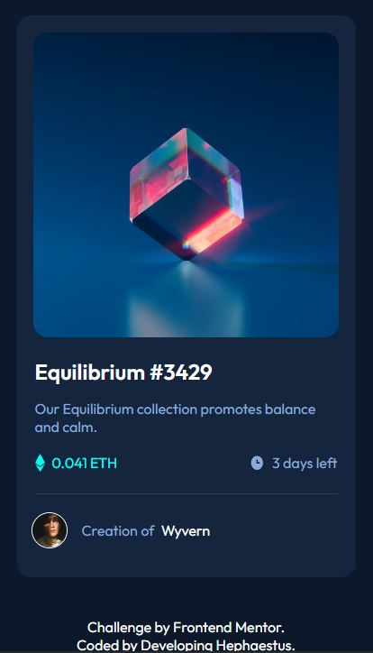

# Frontend Mentor - NFT preview card component solution

This is a solution to the [NFT preview card component challenge on Frontend Mentor](https://www.frontendmentor.io/challenges/nft-preview-card-component-SbdUL_w0U). Frontend Mentor challenges help you improve your coding skills by building realistic projects. 

## Table of contents

- [Overview](#overview)
  - [The challenge](#the-challenge)
  - [Screenshot](#screenshot)
  - [Links](#links)
- [My process](#my-process)
  - [Built with](#built-with)
  - [What I learned](#what-i-learned)
  - [Continued development](#continued-development)
  - [Useful resources](#useful-resources)
- [Author](#author)

## Overview

### The challenge

Users should be able to:

- View the optimal layout depending on their device's screen size
- See hover states for interactive elements

### Screenshot

### Links

- Solution URL: [Add solution URL here](https://your-solution-url.com)
- Live Site URL: [Add live site URL here](https://your-live-site-url.com)

## My process

### Built with

- HTML5
- CSS 
- Flexbox
- Desktop-first workflow

### What I learned

I've gotten much faster at completing these basic challenges. I've now gotten it down to just a few hours to complete the newbie challenges from Front End Mentor. Very interesting to see how quickly it takes me now from a while a go. 

The main take aways I got from completing this challenge was how to overlay and use :hover to create an image with an opaque cyan color over it. I didn't do too much googling to figure this out but it did take me down yet another rabit hole that although unrealted to getting the job done for this challenge it helped me solidify several concepts. 

I'm much more comfortable using images and overall creating a decent outline of a website. I still have issues remembering certain properties but because I dealt with something similar in the past I'm able to quickly google to find my answer. 

### Continued development

For this challenge I used a desktop-first workflow but at some point I want to give mobile-first a try. I don't expect it will be much different with the exception testing everything using a smaller screen size in my browers dev tools but I'm a newb, what do i know.

I'm going to give CSS Grid a try. I feel comfortable in Flexbox and I think that using Grid will improve my workflow given that certain things are much easier to accomplish when using that technology. I've seen other Fontend Montor users use it with great success. From what I've seen, it makes centering things a lot easier and creating the outline of the website straight forward. 

In my next challenge I'm going to do one more newbie challenge to see how quickly I'm able to finish the project. My goal is to finish a newbie challenge within one hour. 

### Useful resources

- [Image Hover Effects Tutorial](https://kinsta.com/blog/css-image-styling/) - This website was my primary resource when trying to figure out how to get the cyan color to overlap opaquely with the main image. 

## Author

- Website - [Developing Haphaestus](https://github.com/UnknownBuilder)
- Frontend Mentor - [@Developing Hephaestus](https://www.frontendmentor.io/profile/UnknownBuilder)
